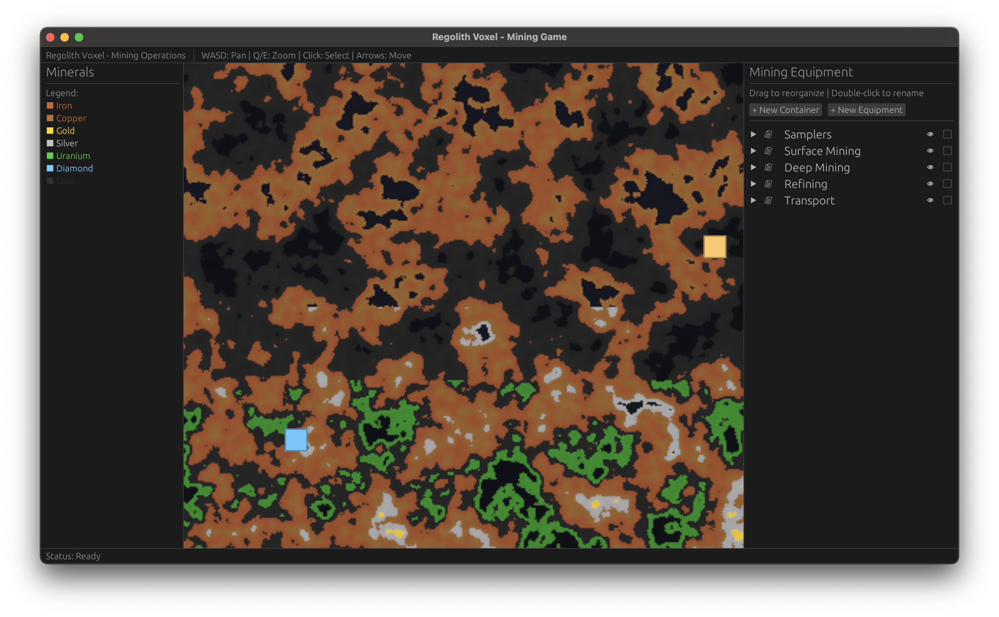

# Regolith Voxel



## Overview

**Regolith Voxel** is an experimental mining simulation game exploring indirect control of semi-autonomous agents. The game serves as a testbed for reinforcement learning (RL) research, where players manage mining operations by directing autonomous equipment rather than controlling them directly.

## Concept

### Indirect Control Paradigm

Unlike traditional games where players directly control units, Regolith Voxel implements an **indirect control system** where:

- Players deploy and organize mining equipment
- Equipment operates semi-autonomously based on their type and position
- Players influence behavior through high-level strategic decisions rather than direct commands
- The challenge lies in emergent behavior from multiple interacting autonomous agents

### Reinforcement Learning Experimental Platform

This project is designed as an **RL experiment** for:

- **Agent Behavior**: Each piece of equipment can be trained as an RL agent to optimize its mining strategy
- **Multi-Agent Coordination**: Testing coordination between multiple autonomous agents with different goals
- **Hierarchical Control**: Exploring hierarchical RL where players provide high-level goals and agents determine low-level actions
- **Reward Shaping**: Experimenting with different reward structures for mining efficiency, resource gathering, and equipment coordination

## Features

### Mining Operations
- **Procedurally generated mineral map** using Perlin noise with multiple mineral types (Iron, Copper, Gold, Silver, Uranium, Diamond, Coal)
- **Depth-based mineral distribution** - rarer minerals appear deeper in the map
- **Visual mineral indicators** - color-coded terrain shows resource locations

### Equipment Management
- **Five equipment types**:
  - **Samplers**: Analyze mineral composition without extraction
  - **Surface Mining**: Extract minerals from upper layers
  - **Deep Mining**: Extract minerals from deep deposits
  - **Refining**: Process raw minerals into refined materials
  - **Transport**: Move resources between locations

### Hierarchical Organization
- **Drag-and-drop tree structure** powered by [egui-arbor](https://github.com/kyjohnso/egui-arbor)
- **Organize equipment** into containers for better management
- **Rename nodes** with double-click inline editing
- **Visual hierarchy** with expandable/collapsible containers

### User Interface
- **Interactive mineral map** with pan (WASD) and zoom (Q/E) controls
- **Equipment tree panel** for managing and organizing units
- **Click-to-select** equipment with visual feedback (green outline)
- **Arrow key movement** for selected equipment
- **Dynamic equipment creation** through UI buttons

## Technology Stack

- **[Bevy](https://bevyengine.org/)** - Game engine and ECS framework
- **[egui](https://github.com/emilk/egui)** - Immediate mode GUI
- **[egui-arbor](https://github.com/kyjohnso/egui-arbor)** - Tree/outliner widget for hierarchical data
- **[noise-rs](https://github.com/Razaekel/noise-rs)** - Procedural generation

## Building and Running

### Prerequisites
- Rust 1.76 or later
- Cargo

### Build
```bash
cargo build --release
```

### Run
```bash
cargo run --release
```

## Controls

- **WASD**: Pan camera
- **Q/E**: Zoom in/out
- **Left Click**: Select equipment
- **Arrow Keys**: Move selected equipment
- **Double-click**: Rename tree nodes (in right panel)
- **Drag & Drop**: Reorganize equipment hierarchy (in right panel)

## Future RL Integration

The codebase is structured to support future RL experiments:

1. **Agent Interface**: Each equipment type can implement a policy interface
2. **State Observation**: Equipment can observe local mineral density, nearby equipment, and resource levels
3. **Action Space**: Equipment can choose movement, extraction rates, and cooperation behaviors
4. **Reward Signal**: Track mining efficiency, resource collection, and equipment utilization
5. **Training Environment**: The game loop provides a step-based simulation suitable for RL training

## License

Licensed under either of:

- Apache License, Version 2.0 ([LICENSE-APACHE](LICENSE-APACHE) or http://www.apache.org/licenses/LICENSE-2.0)
- MIT license ([LICENSE-MIT](LICENSE-MIT) or http://opensource.org/licenses/MIT)

at your option.

## Contribution

Unless you explicitly state otherwise, any contribution intentionally submitted for inclusion in the work by you, as defined in the Apache-2.0 license, shall be dual licensed as above, without any additional terms or conditions.
